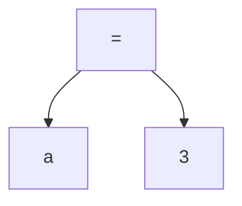

# Local Variable Assignment

## Example. a = 3

### AST



### X86 Assembly

```assembly
; Lhs
mov rax, rbp
sub rax, 8 ; 8 is the offset of a. it depends on the number of local variables.
push rax

; Rhs
push 3

; Assignment
pop rdi
pop rax
mov [rax], rdi
push rax
```
