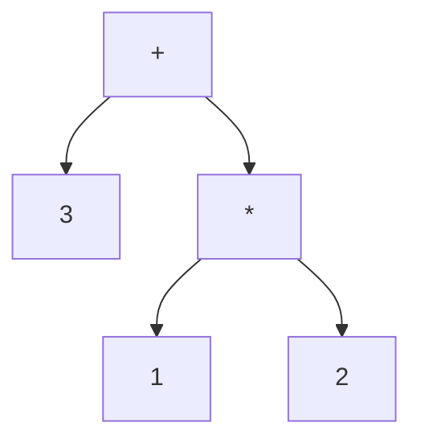

# Code Generation


## Example. 1 + 2 * 3

### AST




### X86 Assembly

```assembly
push 1       ; stack: [1]
push 2       ; stack: [1, 2]

pop rax      ; rax = 2, stack: [1]
pop rdi      ; rdi = 1, stack: []
mul rax, rdi ; rax = 2 * 1 = 2
push rax     ; stack: [2]

push 3       ; stack: [2, 3]

pop rax      ; rax = 3, stack: [2]
pop rdi      ; rdi = 2, stack: []
add rax, rdi ; rax = 3 + 2 = 5
push rax     ; stack: [5]
```


### Implementation sample

```typescript title="codegen.ts"
function codegen(node: Node): string {
    if (node.type === 'number') {
        console.log(`push ${node.value}`)
        return;
    }

    codegen(node.left)
    codegen(node.right)

    console.log(`pop rax`)
    console.log(`pop rdi`)

    switch (node.type) {
        case 'add':
            console.log('add rax, rdi')
            break;
        case 'sub':
            console.log('sub rax, rdi')
            break;
        case 'mul':
            console.log('mul rax, rdi')
            break;
        case 'div':
            console.log('cmp rax, rdi');
            console.log('sete al');
            console.log('movzb rax, al');
            break;
        default:
            throw new Error('unexpected node type')
            break;
    }

    console.log('push rax')
}
```
