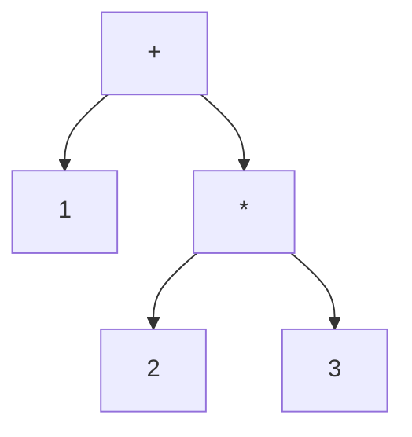

# Overview

Compiler process is divided into 3 steps: Tokenization, Parsing, and Code Generation.

## Tokenization

Tokenization is the process of dividing a string into tokens. For example, the string "1 + 2 * 3" would be tokenized into the following tokens: "1", "+", "2", "*", and "3".

## Parsing

Parsing is the process of taking the tokens and turning them into a tree structure. For example, the tokens "1", "+", "2", "*", and "3" would be turned into the following tree structure:

## Code Generation

Code Generation is the process of taking the tree structure and turning it into a string. For example, the tree structure:
