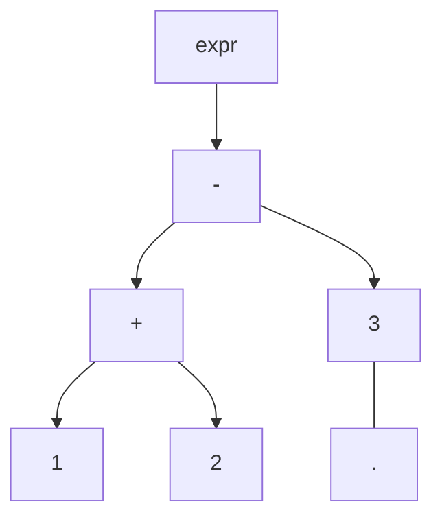
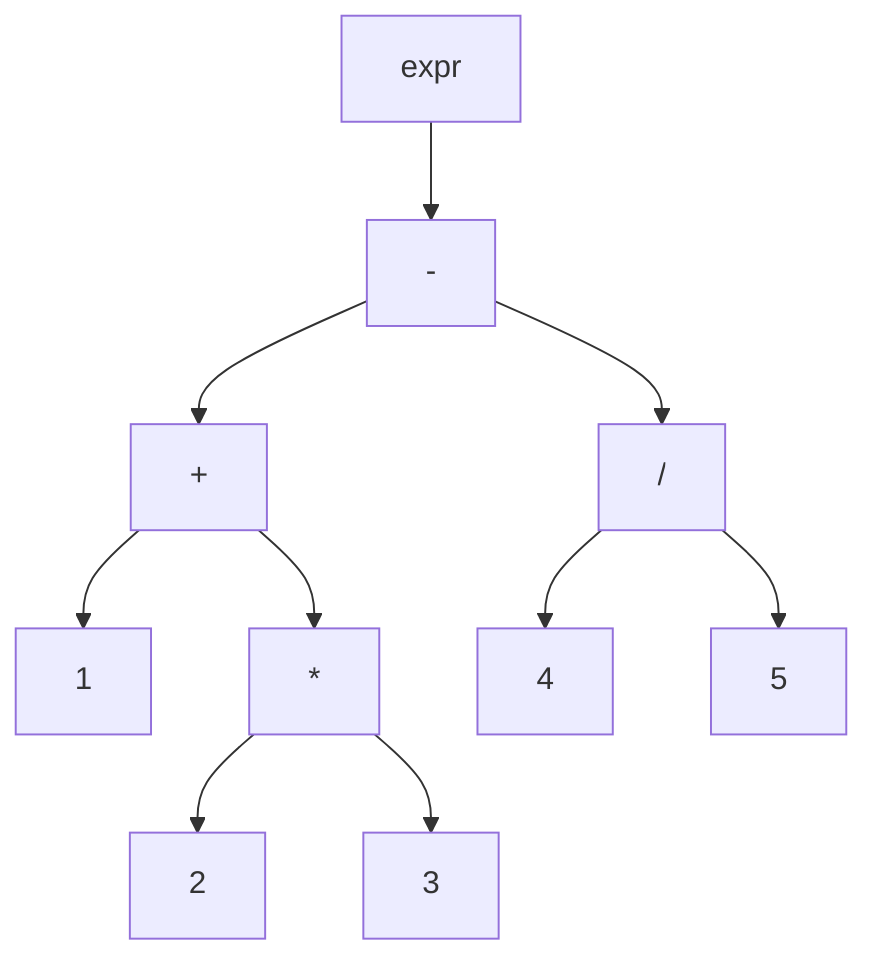

# Parser

## Add and Sub Parser

### BNF

```ebnf
expr ::= number ('+' number | '-' number)*
number ::= [0-9]+
```

### AST

ex) 1 + 2 - 3




### Implementation sample

```typescript title="parser.ts"
type Node = {
    type: 'number' | 'add' | 'sub',
    value: string,
    left: Node,
    right: Node
}

function expr(token: Token): Node {
    let node = number(token)

    while (!atEOF(token)) {
        if (consume(token, '+')) {
            token = token.next
            node = newNode('add', node, number(token))
        } else if (consume(token, '-')) {
            token = token.next
            node = newNode('sub', node, number(token))
        } else {
            throw new Error('unexpected token')
        }
    }
}

function number(token: Token): Node {
    return {
        type: 'number',
        value: token.value,
        left: null,
        right: null
    }
}
```

## Support Mul and Div

### BNF

```ebnf
expr ::= term ('+' term | '-' term)*
term ::= factor ('*' factor | '/' factor)*
factor ::= number
number ::= [0-9]+
```

### AST

ex) 1 + 2 * 3 - 4 / 5



### Implementation sample

```typescript title="parser.ts"
function expr(token: Token): Node {
    let node = term(token)

    while (!atEOF(token)) {
        if (consume(token, '+')) {
            token = token.next
            node = newNode('add', node, term(token))
        } else if (consume(token, '-')) {
            token = token.next
            node = newNode('sub', node, term(token))
        } else {
            throw new Error('unexpected token')
        }
    }
}

function term(token: Token): Node {
    let node = factor(token)

    while (!atEOF(token)) {
        if (consume(token, '*')) {
            token = token.next
            node = newNode('mul', node, factor(token))
        } else if (consume(token, '/')) {
            token = token.next
            node = newNode('div', node, factor(token))
        } else {
            break
        }
    }

    return node
}

function factor(token: Token): Node {
    return number(token)
}
```

